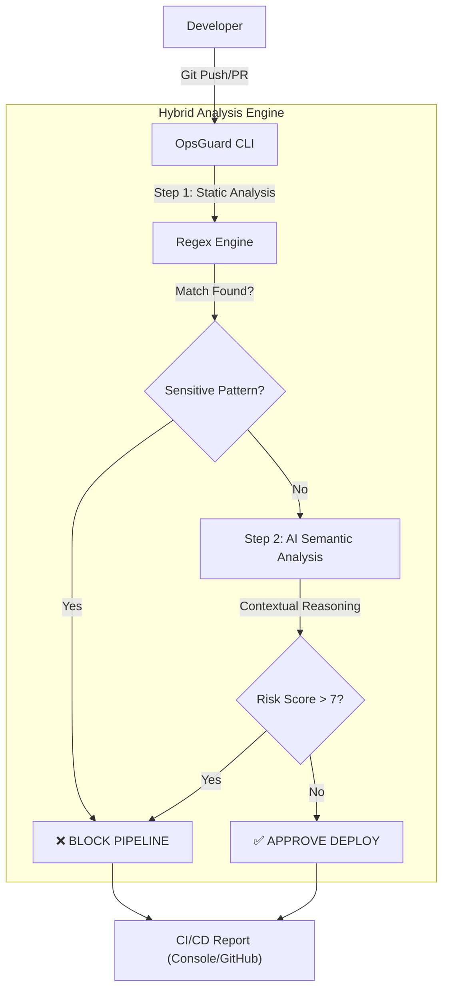
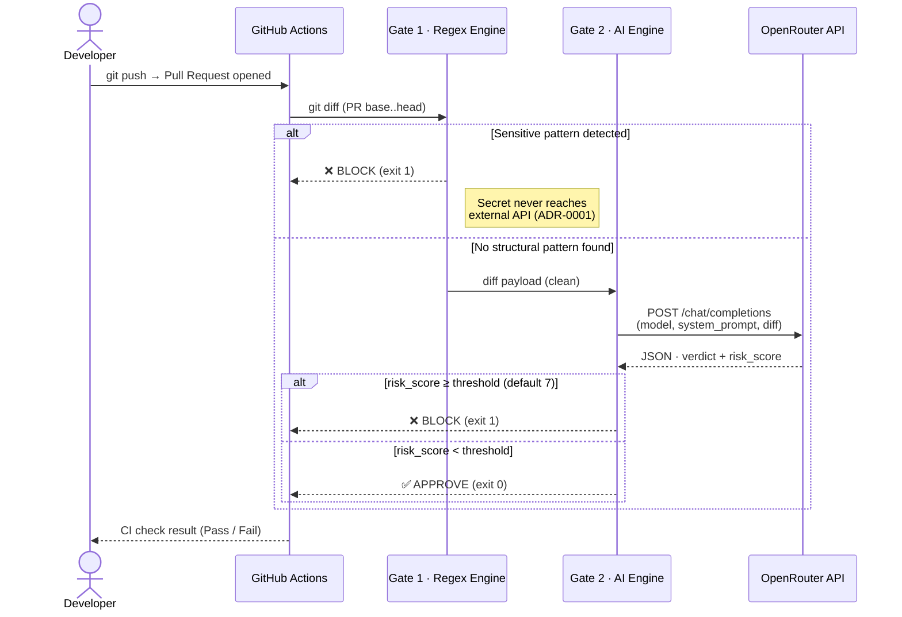

# 🛡️ OpsGuard-AI
> **Context-Aware Security Gate for DevOps Pipelines.**


OpsGuard es una herramienta de Ingeniería de Plataforma que actúa como **puerta de seguridad en el momento del Pull Request**, antes de que ningún cambio llegue a la rama principal. Analiza el `git diff` de cada PR en tiempo real mediante un sistema de doble puerta: **Regex de Alta Entropía** (detección determinista de secretos) seguido de **Análisis Semántico por IA** (razonamiento contextual sobre vulnerabilidades lógicas). Si detecta una amenaza, bloquea el merge automáticamente. Si el código es seguro, aprueba el pipeline sin fricción.

---

## ✨ Funcionalidades Principales
- **🛡️ Hybrid Analysis Engine:** Fusión de análisis estático (velocidad) y LLMs (contexto).
- **🧠 Semantic Logic Check:** Detecta vulnerabilidades complejas como Inyecciones SQL o Backdoors lógicos que el Regex ignora.
- **⚡ Zero-Latency Focus:** Filtrado inteligente para no bloquear el pipeline innecesariamente.
- **📝 Automated Audit Logs:** Generación de evidencias forenses en cada ejecución.
- **🔔 Automatic Security Alerts:** Cuando OpsGuard bloquea un PR, crea automáticamente un GitHub Issue con etiqueta `security-block` - los responsables reciben notificación por email via GitHub sin configuración adicional.

---

## 🔍 ¿Por qué OpsGuard? Comparativa con herramientas existentes

El ecosistema de seguridad en pipelines ya cuenta con herramientas maduras. OpsGuard no pretende reemplazarlas, sino cubrir el nicho específico que ninguna de ellas cubre: **el análisis semántico de lógica compleja con privacidad garantizada**.

| Capacidad | Gitleaks | Semgrep | Trivy | **OpsGuard** |
|-----------|:--------:|:-------:|:-----:|:------------:|
| Detección de secretos (Regex) | ✅ | ✅ | ❌ | ✅ Gate 1 |
| Análisis semántico con IA | ❌ | ⚠️ Limitado | ❌ | ✅ Gate 2 |
| Detección de SQL Injection lógica | ❌ | ⚠️ Patrones | ❌ | ✅ Contextual |
| Detección de backdoors de lógica | ❌ | ❌ | ❌ | ✅ |
| Detección de typosquatting de dominios | ❌ | ❌ | ❌ | ✅ |
| Privacidad: secretos nunca salen del entorno | ✅ | ❌ SaaS | ✅ | ✅ ADR-0001 |
| Integración nativa GitHub Actions | ✅ | ✅ | ✅ | ✅ |
| Coste de inferencia | Gratuito | Gratuito/Pago | Gratuito | ~$0.001/PR |
| Modelo de IA intercambiable | ❌ | ❌ | ❌ | ✅ Env var |

### El nicho de OpsGuard: vulnerabilidades que el Regex no puede ver

- **Gitleaks** es la mejor herramienta para detección de secretos por patrones. Gate 1 de OpsGuard cubre exactamente ese caso, pero Gate 2 añade la capa que Gitleaks no tiene: razonamiento contextual.
- **Semgrep** detecta vulnerabilidades con reglas escritas por humanos. Es potente pero frágil ante variaciones de código no contempladas en las reglas. No tiene razonamiento semántico real.
- **Trivy** escanea dependencias, imágenes de contenedor e IaC. Su dominio es distinto: vulnerabilidades conocidas (CVEs), no lógica de código nuevo.
- **OpsGuard** es la única herramienta de este listado que puede detectar un ataque de typosquatting como `ghrc.io` vs `ghcr.io` - un dominio sintácticamente válido que ningún escáner estático identificaría como amenaza.

> 💡 **Patrón de uso recomendado:** OpsGuard y Trivy son complementarios, no competidores. Trivy audita dependencias; OpsGuard audita la lógica del código nuevo que entra por PR.

---

## 🛠️ Stack Tecnológico
Este proyecto ha sido construido utilizando estándares modernos de Ingeniería de Software:

- **Lenguaje Core:** Python 3.12+
- **Gestión de Dependencias:** Poetry (Aislamiento de entornos).
- **IA & NLP:** OpenRouter / Google Gemini Flash 2.0 (Motor de inferencia).
- **CLI Framework:** Typer & Rich (Interfaz de terminal interactiva).
- **CI/CD:** GitHub Actions (Automatización del pipeline).
- **Validación:** Pytest (Testing unitario) & Pre-commit hooks.

---

## 📂 Estructura del Proyecto
Organización modular del código fuente:

```text
OpsGuard-AI/
├── .github/workflows/    # Pipelines de CI/CD (GitHub Actions)
├── docs/                 # Documentación del proyecto
│   ├── adr/              # Architecture Decision Records (Decisiones técnicas)
│   └── evidence/         # Capturas y logs de auditoría (Pruebas de ejecución)
├── prompts/              # Ingeniería de Prompts (System Instructions & Contexto)
├── src/                  # Código fuente de la aplicación
│   ├── ai.py             # Motor de análisis semántico (Cliente LLM)
│   ├── security.py       # Motor de análisis estático (Regex Patterns)
│   ├── console_ui.py     # Interfaz de usuario (Rich/Typer)
│   ├── ingest.py         # Procesamiento de Git Diffs y lectura de archivos
│   └── main.py           # Punto de entrada (Entrypoint)
├── scripts/              # Utilidades de diagnóstico y herramientas auxiliares
│   └── net_diag.py       # Diagnóstico de conectividad de red (ping a endpoints)
├── tests/                # Suite de tests y fixtures (Shooting Range)
├── web/                  # Dashboard de monitorización auxiliar (Next.js/Vercel)
├── .env.example          # Plantilla de variables de entorno
├── pyproject.toml        # Configuración de dependencias (Poetry)
├── CHANGELOG.md          # Registro de versiones y ciclo de mejora de calidad
└── README.md             # Punto de entrada de documentación
```

> **Nota sobre `web/`:** El dashboard web es una interfaz de monitorización auxiliar (Next.js / Vercel) que consume la API de GitHub Actions para visualizar en tiempo real el historial de ejecuciones de OpsGuard: KPIs de bloqueos/aprobaciones, tasa de bloqueo y feed de actividad filtrable por estado (`ALL` / `BLOCKED` / `APPROVED`). **La ingeniería central del proyecto reside exclusivamente en `src/`** - el motor de análisis, la integración con el LLM, el pipeline CI/CD y la suite de tests. El directorio `web/` queda fuera del alcance de la evaluación técnica del TFM.

---

## 📂 Documentación Técnica (Engineering Standards)
Para profundizar en las decisiones de arquitectura, costes y privacidad, consulte los **Architecture Decision Records (ADR)**:
- [ADR-001: Patrón Gatekeeper Local](/docs/adr/0001-patron-gatekeeper-local.md)
- [ADR-002: Prompt Engineering & English Tokens](/docs/adr/0002-prompting-en-ingles.md)
- [ADR-003: Telemetría y FinOps](/docs/adr/0003-telemetria-y-finops.md)
- [ADR-004: Política Fail-Closed en Gate 2](/docs/adr/0004-fail-closed-policy.md)
- [ADR-005: Estrategia de Truncado de Diff](/docs/adr/0005-diff-truncation-strategy.md)

**Informe de benchmark completo** (telemetría raw, casos APPROVE, análisis de falsos positivos):
👉 [`docs/benchmark-models.md`](/docs/benchmark-models.md)

---

## ⚡ Quick Start (Modo Evaluación)
Siga estos pasos para probar la herramienta en local sin necesidad de configurar GitHub Actions.

### 1. Instalación
Requisitos: Python 3.12+ y [Poetry](https://python-poetry.org/docs/).

```bash
# 1. Clonar repositorio
git clone https://github.com/oscaar90/OpsGuard-AI.git
cd OpsGuard-AI

# 2. Instalar dependencias (Entorno virtual aislado)
poetry install
```

### 2. Configuración
Renombre el archivo de ejemplo y añada la API Key proporcionada en la entrega del proyecto.
```bash
cp .env.example .env
# Edite .env y pegue la variable OPENROUTER_API_KEY
```

El sistema es configurable mediante variables de entorno sin modificar código:

| Variable | Descripción | Por defecto |
|----------|-------------|-------------|
| `OPENROUTER_API_KEY` | API Key de OpenRouter (**obligatoria**) | - |
| `OPSGUARD_MODEL` | Modelo LLM a usar en Gate 2 | `google/gemini-2.0-flash-001` |
| `OPSGUARD_RISK_THRESHOLD` | Puntuación mínima para bloquear | `7` |
| `OPSGUARD_TELEMETRY_MODE` | Verbosidad de telemetría FinOps (`verbose` / `summary` / `silent`) | `verbose` |

### 3. Ejecutar Prueba de Concepto (Shooting Range)
Hemos incluido una suite de archivos intencionalmente vulnerables en `tests/fixtures/vulnerable_app/` para demostrar la detección. Pueden usarse de dos formas:

#### 3a. Validación Automática (pytest)
Ejecuta los tests unitarios del motor de detección. No requiere API Key.

```bash
poetry run pytest tests/test_security.py -v
```

Valida el comportamiento del **Gate 1 (Regex)**: qué patrones bloquea, qué deja pasar al Gate 2 (IA) y que las líneas eliminadas nunca se penalizan.

#### 3b. Demo Manual (Pipeline en vivo)
Para ver el bloqueo de CI/CD en tiempo real, copie un fixture a otra ruta y abra una Pull Request:

```bash
# Ejemplo: credenciales AWS (bloqueado por Gate 1 - Regex)
cp tests/fixtures/vulnerable_app/aws_creds.env src/aws_creds.env
git checkout -b demo/shooting-range
git add src/aws_creds.env && git commit -m "test: add config"
git push origin demo/shooting-range
# Abrir PR en GitHub → OpsGuard bloqueará el merge automáticamente
```

Consulte [`tests/fixtures/README.md`](tests/fixtures/README.md) para la guía completa con todos los fixtures y sus resultados esperados.

**Inventario de Fixtures:**

| Fichero | Vulnerabilidad | Gate que lo detecta |
|---------|---------------|---------------------|
| `aws_creds.env` | AWS Access Key (`AKIA…`) | Gate 1 - Regex |
| `legacy_login.py` | SQL Injection | Gate 2 - IA |
| `auth_middleware.py` | Developer Backdoor | Gate 2 - IA |
| `config.php` | Password & API Key hardcodeadas | Gate 2 - IA |
| `supply_chain_attack.py` | Typosquatting `ghrc.io` → `ghcr.io` | Gate 2 - IA |

---

## 🏗️ Arquitectura del Motor
El sistema analiza los `git diffs` para optimizar costes y latencia mediante un flujo de doble puerta (Two-Gate System).



### Sequence Diagram - Runtime Actors



---

## 🔬 Caso Real: Detección de Supply-Chain Attack (Typosquatting `ghrc.io`)

### Contexto del Incidente
En febrero de 2025 se descubrió que el dominio **`ghrc.io`** - una transposición deliberada de **`ghcr.io`** (GitHub Container Registry) - estaba siendo utilizado como vector de ataque. Este dominio de typosquatting, reportado a través de un programa de Bug Bounty, clonaba la interfaz del registro oficial de contenedores de GitHub para interceptar imágenes Docker.

Este tipo de ataques de **Supply-Chain** ha afectado masivamente al ecosistema de GitHub, con cientos de miles de intentos documentados de envenenamiento de paquetes y registros. Un desarrollador que escriba `ghrc.io` en vez de `ghcr.io` en un `Dockerfile` o script CI podría:
- **Enviar imágenes corporativas** a un registro controlado por atacantes.
- **Descargar imágenes troyanizadas** que reemplacen dependencias legítimas.
- **Comprometer toda la cadena de despliegue** sin que ningún linter o escáner estático lo detecte.

### Prueba de Detección
Hemos incluido un fixture de prueba (`tests/fixtures/vulnerable_app/supply_chain_attack.py`) que simula este escenario y lo hemos ejecutado contra OpsGuard:

| Motor | Resultado | Detalle |
| :--- | :---: | :--- |
| **Gate 1 - Regex** | ✅ PASS | No existe patrón determinista para typosquatting de dominios |
| **Gate 2 - IA Semántica** | ⛔ **BLOCK** | `risk_score: 7/10`, Severity: `HIGH`. Identificó correctamente `ghrc.io` como typosquatting de `ghcr.io` |

> **💡 Valor diferencial:** Este caso demuestra por qué el análisis semántico por IA es un complemento necesario al Regex. Un escáner estático convencional (SAST) **nunca** detectaría este ataque porque `ghrc.io` es un dominio válido sintácticamente. Solo un motor con **razonamiento contextual** puede identificar la anomalía.

📍 **Evidencia CI/CD:** Consulte el [Workflow Run en GitHub Actions](../../actions) para ver el bloqueo automatizado de este fixture en el pipeline.

---

## 🤖 Caso Real: OpsGuard como Red de Seguridad ante Agentes de IA Autónomos

### El nuevo vector de ataque: AI-generated code en el pipeline

Los agentes de IA autónomos (GitHub Copilot Workspace, Cursor Agent, Devin, OpenClaw...) han cambiado el modelo de amenaza en los pipelines de CI/CD. Ya no solo los desarrolladores humanos abren Pull Requests: **los agentes de IA con acceso de escritura al repositorio pueden crear ramas, modificar ficheros y abrir PRs de forma autónoma**.

Esto introduce dos categorías de riesgo que no existían antes:

| Riesgo | Descripción | Ejemplo |
|--------|-------------|---------|
| **Credenciales por alucinación** | El agente genera código con credenciales hardcodeadas que "inventó" o extrajo del contexto del repositorio | API key de Stripe en un servicio de pagos |
| **Lógica insegura generada** | El agente produce patrones inseguros (SQL injection, auth bypass) sin comprender las implicaciones de seguridad | f-string en query SQL, master bypass token |

Un agente comprometido, jailbroken o simplemente con alucinaciones inseguras puede introducir vulnerabilidades que **ningún revisor humano aprobaría** - pero que podrían colarse si el pipeline no tiene una puerta de seguridad.

### Prueba de Detección - Agente autónomo que modifica `src/payment_service.py`

Hemos verificado que OpsGuard bloquea ambas categorías en vivo. El fixture [`tests/fixtures/vulnerable_app/ai_agent_commit.py`](tests/fixtures/vulnerable_app/ai_agent_commit.py) simula el commit de un agente que añade un servicio de pagos con múltiples vulnerabilidades.

#### Gate 1 - Bloqueo de credenciales hardcodeadas (0ms, sin LLM)

El agente hardcodeó una Stripe API Key real y un master bypass token. Gate 1 los detecta sin llamar a ninguna API externa:

```
🚨 DETECTED 2 STATIC VIOLATIONS:
┌──────────────────────────────────────────────────────────────┬──────┐
│ Type                                                         │ File │
├──────────────────────────────────────────────────────────────┼──────┤
│ [Generic Secret] Found pattern: SECRET                       │ Diff │
│ [Stripe API Key] Found pattern: sk_live_4eC39HqLyjWDarjtT1z │ Diff │
└──────────────────────────────────────────────────────────────┴──────┘
⛔ PIPELINE BLOCKED: SECURITY VIOLATION DETECTED
```

> **Privacidad garantizada (ADR-0001):** la Stripe key nunca sale del entorno local. Gate 1 bloquea antes de que Gate 2 envíe nada a OpenRouter.

#### Gate 2 - Bloqueo de lógica insegura generada (sin credenciales visibles)

Cuando el agente no incluye secretos estructurales pero sí genera código con SQL injection y auth bypass, Gate 1 no detecta nada. Gate 2 analiza el contexto semántico y bloquea con `risk_score: 9/10`:

```
✅ No static credential patterns found.
🤖 OpsGuard Brain: Sending diff to google/gemini-2.0-flash-001...

⛔ Verdict: BLOCK | Risk Score: 9/10

CRITICAL │ src/payment_service.py │ L13 │ SQL injection in get_user_balance - username interpolated directly
CRITICAL │ src/payment_service.py │ L29 │ SQL injection in update_user_balance - unsanitized f-string
MEDIUM   │ src/payment_service.py │ L21 │ Auth bypass via X-INTERNAL-ADMIN header

⛔ PIPELINE BLOCKED: SECURITY VIOLATION DETECTED
```

### Por qué OpsGuard es la última línea de defensa ante AI agents

```
AI Agent (Copilot/Cursor/Devin)
        │
        ▼
  git push → PR abierto
        │
        ▼
  ┌─────────────────────────────────┐
  │  OpsGuard Gate 1 (Regex)        │  ← Bloquea credenciales en <1ms
  │  OpsGuard Gate 2 (LLM semántico)│  ← Bloquea lógica insegura en ~4s
  └─────────────────────────────────┘
        │
        ▼  Solo si ambos gates pasan
  merge a main
```

> **El caso de uso emergente:** A medida que los agentes de IA ganan autonomía en los pipelines, OpsGuard se convierte en el equivalente a un revisor de seguridad humano que nunca duerme, no se distrae y no puede ser presionado para aprobar un PR con vulnerabilidades.

---

## 🤝 Estándares de Desarrollo (Conventional Commits)
Este proyecto sigue estrictamente la especificación **[Conventional Commits](https://www.conventionalcommits.org/)**.

| Tipo | Descripción | Ejemplo |
| :--- | :--- | :--- |
| `feat` | Nueva funcionalidad | `feat: add AI semantic analysis engine` |
| `fix` | Corrección de error | `fix: resolve regex pattern for AWS keys` |
| `docs` | Cambios en documentación | `docs: add ADR 001` |
| `chore` | Mantenimiento / Configuración | `chore: update poetry dependencies` |
| `test` | Tests unitarios o de integración | `test: add shooting range fixtures` |

---

## 📋 Registro de Cambios (CHANGELOG)

El proyecto incluye un [`CHANGELOG.md`](CHANGELOG.md) que documenta el ciclo completo de ingeniería de calidad realizado sobre la versión de entrega del TFM.

No es un simple historial de commits: cada entrada describe el **problema identificado**, la **decisión técnica tomada** y la **Pull Request que lo implementa**, permitiendo al evaluador verificar cada cambio directamente en GitHub.

| Versión | Descripción |
|---------|-------------|
| `1.0.4` | Public Release License Sprint - cambio a Elastic License 2.0 para publicación en GitHub Marketplace |
| `1.0.3` | Benchmark Hardening Sprint - revisión de integridad del informe: fixtures limpiados, sección de limitaciones, métricas con terminología ML precisa |
| `1.0.2` | Operational Alerting Sprint - GitHub Issue automático con etiqueta `security-block` al bloquear un PR |
| `1.0.1` | Polish & Hardening - graficas Mermaid en ADR-0003, normalizacion tipografica, `.gitignore` reforzado |
| `1.0.0` | Prompt Engineering Documentation Sprint - `prompts/README.md`, evolución y decisiones de prompt |
| `0.9.0` | GitHub Action Marketplace Sprint - `action.yml`, release workflow, guía integración 5 min |
| `0.8.0` | AI Model Benchmark Sprint - comparativa empírica Gemini Flash vs Haiku vs GPT-4o-mini |
| `0.7.0` | Competitive Positioning Sprint - comparativa Semgrep/Gitleaks/Trivy, nicho diferencial |
| `0.6.0` | Architecture Documentation Sprint - ADR-0004 fail-closed, contratos de módulo |
| `0.5.0` | Code Quality Sprint - prompt externalizado, ADR-0005, auditoría CVE en CI |
| `0.4.0` | Testing Coverage Sprint - tests AIEngine, E2E pipeline, gate cobertura 80% |
| `0.3.0` | Quality Audit Sprint - corrección de blockers, tests unitarios, telemetría ADR-0003, principio de mínimo privilegio |
| `0.2.0` | Supply-Chain Detection & Action Alignment |
| `0.1.0` | TFM Final Delivery - versión de entrega académica |

---

## 🚀 Integra OpsGuard en tu pipeline (5 minutos)

OpsGuard está disponible como **GitHub Action** reutilizable. Cualquier equipo puede añadirlo a su pipeline sin clonar el repositorio ni gestionar dependencias:

### Paso 1 - Añade el secreto

En tu repositorio: **Settings → Secrets and variables → Actions → New repository secret**

```
Name:  OPENROUTER_API_KEY
Value: <tu api key de openrouter.ai>
```

### Paso 2 - Crea el workflow

Crea el fichero `.github/workflows/security.yml` en tu repositorio:

```yaml
name: OpsGuard Security Gate

on:
  pull_request:
    types: [opened, synchronize, reopened]

jobs:
  security-scan:
    name: 🕵️ OpsGuard Scan
    runs-on: ubuntu-latest
    permissions:
      contents: read

    steps:
      - name: Checkout
        uses: actions/checkout@v4
        with:
          fetch-depth: 0          # Required: full history to compare PR base and head

      - name: OpsGuard Security Scan
        uses: oscaar90/OpsGuard-AI@v1
        with:
          openrouter-api-key: ${{ secrets.OPENROUTER_API_KEY }}
```

Abre un PR y OpsGuard bloqueará automáticamente cualquier cambio que contenga secretos, vulnerabilidades lógicas o ataques de supply-chain.

> **Alertas automáticas:** Si quieres que OpsGuard cree un GitHub Issue cuando bloquea un PR (con notificación por email a los responsables), añade `issues: write` a los permisos y el step de creación de Issue. Ver el workflow completo de OpsGuard en [`.github/workflows/opsguard.yml`](.github/workflows/opsguard.yml) como referencia.

### Configuración avanzada

| Input | Descripción | Por defecto |
|-------|-------------|-------------|
| `openrouter-api-key` | API Key de OpenRouter (**obligatoria**) | - |
| `risk-threshold` | Puntuación mínima para bloquear (0–10) | `7` |
| `model` | Modelo LLM para Gate 2 | `google/gemini-2.0-flash-001` |
| `telemetry-mode` | Verbosidad (`verbose` / `summary` / `silent`) | `verbose` |

---

## 🔧 Integración CI/CD (modo desarrollo)
Para contribuir al proyecto o probarlo en local, OpsGuard incluye su propio pipeline de CI/CD.
1. Workflow: `.github/workflows/opsguard.yml`.
2. Secretos requeridos: `OPENROUTER_API_KEY`. (Facilitados al profesorado en el PDF)

### 🧪 Evidencias de Ejecución
Puede consultar logs reales y capturas de funcionamiento en la carpeta de evidencias:
👉 [Ver Logs y Capturas](/docs/evidence)

#### 📊 Benchmark de modelos (telemetría completa)

Informe con los registros de telemetría JSON de las 12 combinaciones fixture/modelo, 3 casos APPROVE (sin falsos positivos) y análisis FinOps a escala:
👉 [`docs/benchmark-models.md`](/docs/benchmark-models.md)

#### 🔔 Issues de seguridad generados automáticamente (v1.0.2)

Los siguientes Issues fueron creados de forma autónoma por OpsGuard al bloquear 5 PRs de demo, verificando el ciclo operacional completo:

| Issue | Tipo de amenaza | Puerta |
|-------|-----------------|--------|
| [#60 - OpsGuard blocked PR #59](https://github.com/oscaar90/OpsGuard-AI/issues/60) | Credenciales AWS hardcodeadas | Gate 1 - Regex |
| [#64 - OpsGuard blocked PR #61](https://github.com/oscaar90/OpsGuard-AI/issues/64) | SQL Injection via f-string | Gate 2 - LLM |
| [#66 - OpsGuard blocked PR #62](https://github.com/oscaar90/OpsGuard-AI/issues/66) | Backdoor de desarrollador (`X-DEBUG-MODE`) | Gate 2 - LLM |
| [#67 - OpsGuard blocked PR #63](https://github.com/oscaar90/OpsGuard-AI/issues/67) | Secrets hardcodeados en config PHP | Gate 2 - LLM |
| [#68 - OpsGuard blocked PR #65](https://github.com/oscaar90/OpsGuard-AI/issues/68) | Typosquatting de cadena de suministro | Gate 2 - LLM |

---

⚖️ Licencia

Este proyecto está publicado bajo la **[Elastic License 2.0 (ELv2)](LICENSE)**.

- ✅ Puedes usar OpsGuard en tu pipeline de CI/CD de forma gratuita.
- ✅ Puedes ver, estudiar y modificar el código fuente.
- ❌ No puedes ofrecer OpsGuard como servicio gestionado o producto comercial sin autorización expresa del autor.
- ❌ No puedes redistribuirlo con fines comerciales ni eliminando los avisos de licencia.

Consulte el archivo [LICENSE](LICENSE) para los términos completos. Para acuerdos de licencia comercial: oscar@oscarai.tech

**TFM - Máster en Desarrollo con IA** | Óscar Sánchez Pérez